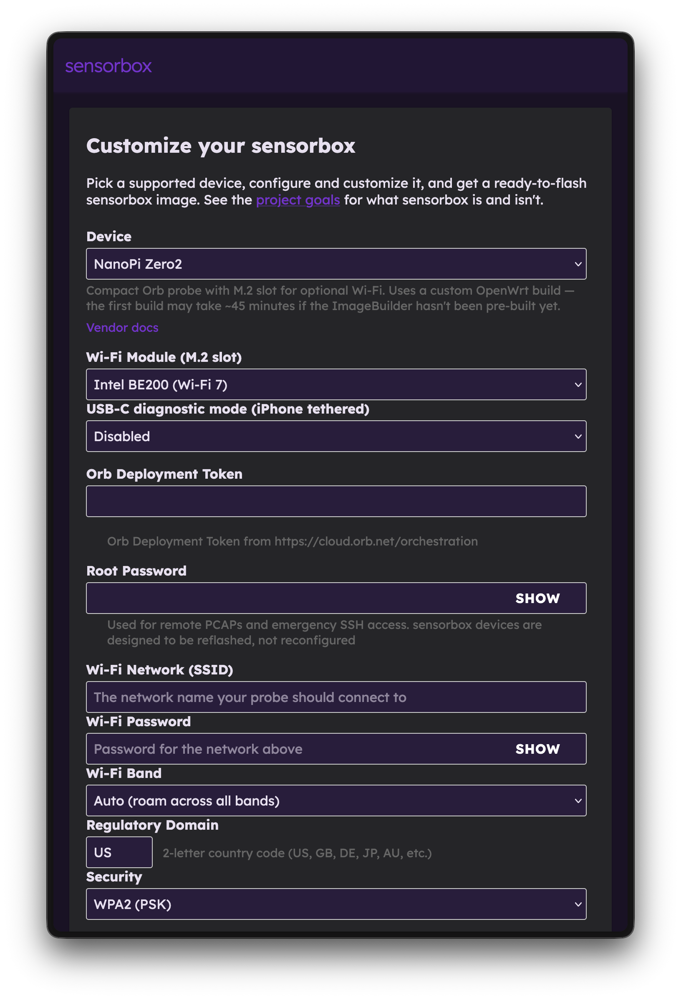

# sensorbox

Self-hosted system for building OpenWrt-based network experience sensor images. Pick a supported device in a local web UI, provide Wi-Fi credentials and customize your install to get an SD-card image with ready to continuously monitor your network experience.

<p align="center"></p>

**Status:** beta. sensorbox builds on two upstream projects:

- [ASU](https://github.com/openwrt/asu)
- [OpenWrt Firmware Selector](https://gitlab.com/openwrt/web/firmware-selector-openwrt-org) — forked to [orbforge/firmware-selector-openwrt-org](https://github.com/orbforge/firmware-selector-openwrt-org) and included here as a git submodule at `firmware-selector/`. This is where Orb-specific UI extensions live.

## Cloning

```bash
git clone --recurse-submodules git@github.com:orbforge/sensorbox.git
```

If you already cloned without `--recurse-submodules`:

```bash
git submodule update --init
```

## Prerequisites (macOS)

sensorbox runs on Podman because ASU's build worker spawns one container per build via the Podman API. Docker is not a tested drop-in substitute.

1. Install Podman and the compose wrapper:

   ```bash
   brew install podman podman-compose
   ```

   Optional GUI:

   ```bash
   brew install --cask podman-desktop
   ```

2. Initialize and start the Podman VM. The resource bumps matter — ASU's ImageBuilder runs will OOM or run out of disk on the defaults:

   ```bash
   podman machine init --cpus 4 --memory 8192 --disk-size 100
   podman machine start
   podman info   # sanity check
   ```

   `--disk-size 100` is a VM ceiling, not preallocated. ASU upstream recommends 50 GB minimum and caches grow over time.

3. After reboots or Podman upgrades:

   ```bash
   podman machine start
   ```

## Prerequisites (Linux)

Install `podman` and `podman-compose` from your distro, then enable the user socket so the ASU worker can reach it:

```bash
systemctl --user enable --now podman.socket
```

No VM needed — Podman runs natively.

## Prerequisites (Windows)

Not yet validated. Podman Desktop supports Windows via WSL2; expect a similar flow to macOS.

## Configure

```bash
cp .env.example .env
```

Edit two values in `.env`:

- **`PUBLIC_PATH`** — set to `/Users/<you>/<path-to>/sensorbox/public` (macOS) or `/home/<you>/<path-to>/sensorbox/public` (Linux), then `mkdir -p "$PUBLIC_PATH"/{store,logs}`.
- **`CONTAINER_SOCKET_PATH`** — run `podman info --format '{{.Host.RemoteSocket.Path}}'` and paste the path (drop the `unix://` prefix).

Leave everything else alone.

## Run the stack

From the repository root:

```bash
podman-compose up -d
```

Open <http://localhost:8080/> in your browser (or whichever port you set as `SELECTOR_PORT` in `.env`), select your device, and configure. The first run pulls the ASU image and builds the openwrt-builder image (a few minutes). Subsequent runs are fast.

Devices that are not in the latest stable OpenWrt release will need to compile from source, which may take a long time for the initial build (e.g. 35 minutes on an M1 MacBook Pro). Subsequent runs are fast.

Once your image builds, flashing instructions specific to your device will be provided in the download section. You can flash the image with popular tools such as Raspberry Pi Imager, balenaEtcher, or dd. There are helper scripts in `scripts/flash-sd-macos.sh` and `scripts/flash-sd-linux.sh`.

Tear down with:

```bash
podman-compose down
```

## Recipes

sensorbox uses yaml "recipes" to power the web-based configurator, inject settings, install packages, and create scripts. See the[recipes README](recipes/README.md) for more information.

## Repository layout

- `firmware-selector/` — git submodule pointing at the Orb fork of the OpenWrt Firmware Selector. This is where Orb-specific UI code belongs. The submodule has `upstream` configured so you can pull improvements from openwrt: `git -C firmware-selector fetch upstream && git -C firmware-selector merge upstream/main`.
- `GOALS.md` — product brief.
- `asu/` (optional, gitignored) — if you want ASU's source locally for reference or debugging: `git clone https://github.com/openwrt/asu asu`. sensorbox never builds from this directory; it's reference material only.
